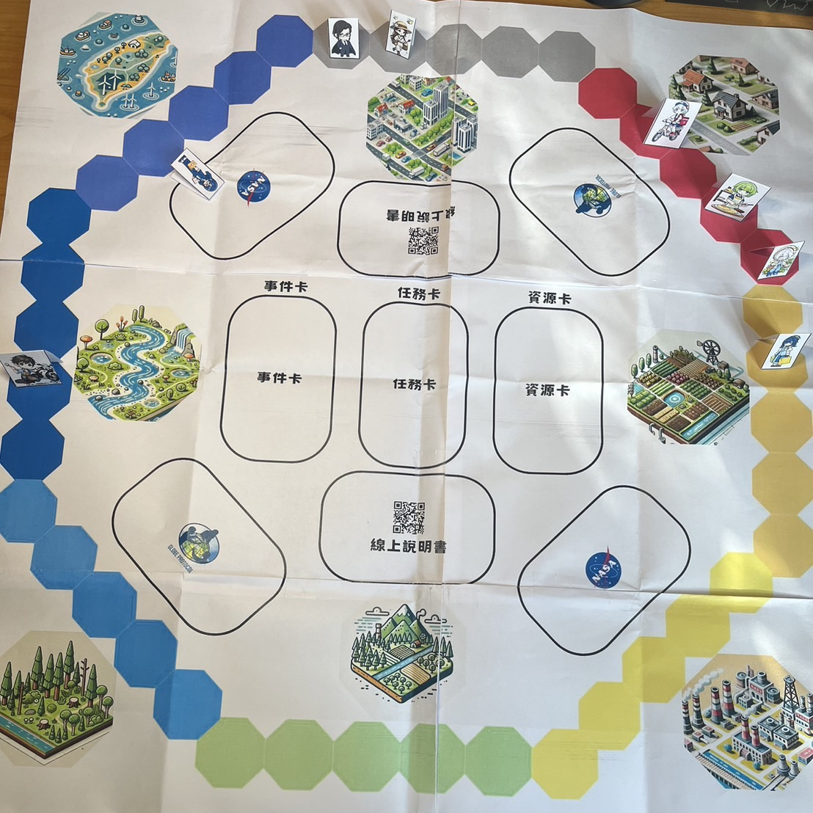
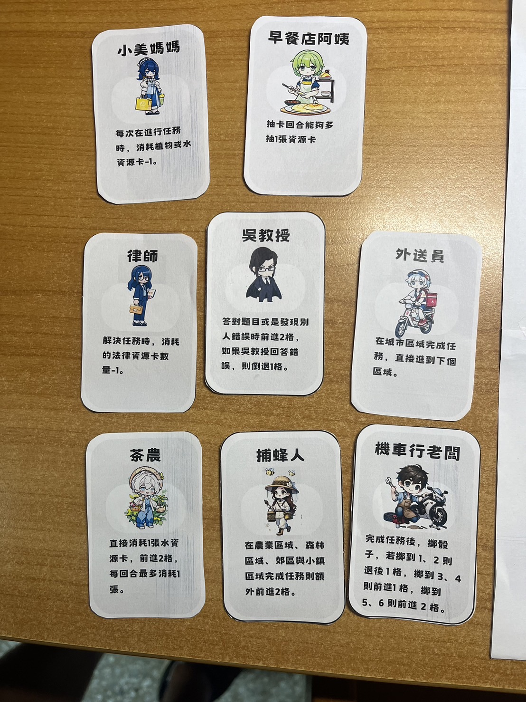

# EcoQuest - Heroes of the GLOBE

[繁體中文](README.md) | English

## **Game Introduction**

"EcoQuest - Heroes of the GLOBE" is a card-based board game that combines environmental education with task-based gameplay. Players learn about local and global environmental issues, as well as scientific principles, by using their resource cards to complete tasks. They can also earn additional points by answering questions related to GLOBE protocols and environmental science.

## **Gameplay Showcase**

  
  
  
  
  

## **Story Background: A Scientific Mission to Save Earth**

In the future, Earth faces an environmental crisis, with climate change, depletion of natural resources, and ecosystem collapse threatening human survival. Global environmental organizations, academic institutions, and governments have decided to unite in launching the NASA SPACE program, an international cooperative mission aimed at protecting Earth. This initiative is based on the GLOBE (Global Learning and Observations to Benefit the Environment) Program, calling for global citizens and professionals to work together to safeguard the planet’s future.

As part of the NASA SPACE program, players take on the roles of environmental heroes from around the world, such as environmental lawyers, Mom Mei, beekeepers, and tea farmers. Each character possesses unique expertise and resources, tasked with protecting their local environment. Through cooperation, players will face environmental disasters, manage limited resources, and find solutions to restore Earth's ecosystems.

Throughout the game, players must complete a series of environmental tasks, such as cleaning polluted water sources, restoring forests, and improving urban air quality. These tasks require close cooperation and resource sharing among the characters. Players must discuss how to allocate their resource cards effectively and plan ahead to solve the current environmental issues.

As the game progresses, the pace of environmental degradation accelerates, and players face random threats such as floods, droughts, or typhoons. These events will impact the players' progress, forcing them to readjust their strategies. Players must adapt quickly and focus resources on the most critical problems to ensure Earth's ecosystems gradually recover.

In the end, when all players successfully complete their environmental tasks and effectively manage the environmental disasters, Earth's condition will greatly improve, and the mission of the NASA SPACE program will be accomplished. Players not only enjoy the teamwork in the game but also gain a deep understanding of the importance of environmental protection.

## **Rulebook**

See the [Rulebook](./rule.md) for details.

## **Board Game Design Files**

[Map](./asset/map.pdf)  |  [Cards](./asset/cards.pdf)
