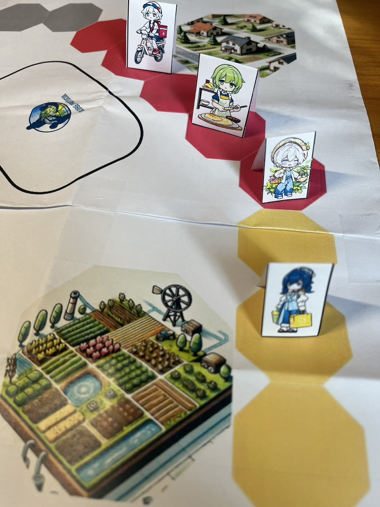

# 環境探索 - GLOBE 守護英雄

繁體中文 | [English](README.en.md)

## 遊戲簡介

"環境探索 - GLOBE 守護英雄" 是一款結合環境教育與任務型遊戲玩法的卡牌類桌遊。玩家在遊戲中學習本地及全球環境議題、科學精神，透過分配自身擁有的資源卡解決任務，並藉由回答 GLOBE 協議相關內容與環境科學知識來獲得更多的得分。

## 遊玩過程展示

  
  
  
  
  

## 故事背景 : 拯救地球的科學行動

未來的地球正面臨一場環境危機，氣候變遷、自然資源枯竭以及生態系統的崩壞威脅著人類的生存。全球的環保組織、學術機構以及各國政府決定聯合起來，啟動 NASA SPACE 計畫，一個旨在保護地球的國際合作行動。這一計畫基於 GLOBE （全球學習及觀測促進環境）計畫，呼籲全球公民和專業人士共同努力，為地球的未來採取行動。

作為 NASA SPACE 計畫的一部分，玩家們將扮演來自全球各地的環保英雄，如環保律師、小美媽媽、捕蜂人、茶農等角色。每個角色都擁有獨特的專業知識和資源，並肩負著拯救自己所在區域環境的重任。透過合作，玩家將在遊戲中應對環境災難，管理有限的資源，並尋找能夠修復地球生態的解決方案。

在遊戲中，玩家需要完成一系列的環保任務，包括淨化污染的水源、恢復森林、改善城市空氣質量等。這些任務並非由單一玩家完成，而是需要各角色之間的緊密合作與資源共享。玩家必須討論如何有效分配手中的資源卡，並制定長遠計劃來解決當前的環境問題。

隨著遊戲進行，環境的惡化速度加劇，玩家會面臨自然災害的隨機威脅，如洪水、乾旱或颱風。這些事件會影響玩家的進度，迫使他們重新調整策略。玩家需要靈活應變，將資源集中在最關鍵的問題上，以確保地球的生態能夠逐步恢復。

最終，當所有玩家成功完成環保任務並有效地控制環境災害時，地球的環境狀況將顯著改善， NASA SPACE 計畫的使命也將圓滿達成。玩家們不僅在遊戲中享受了團隊合作的樂趣，更深刻理解了保護環境的重要性。

## 規則書

詳見 [規則書](./rule.md)

## 桌遊設計圖檔

[地圖](./asset/地圖.pdf)  |  [卡牌](./asset/卡牌.pdf)

