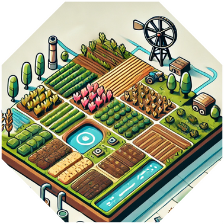
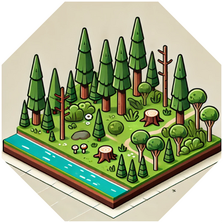
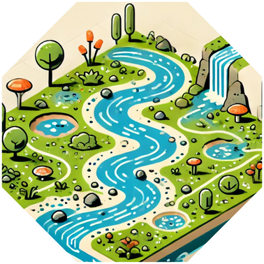
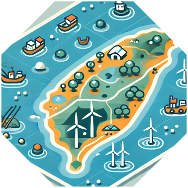

# 環境探索 - GLOBE 守護英雄 : 規則書

繁體中文 | [English](rule.en.md)

- 建議遊戲人數：4-6人
- 建議年齡：8歲以上
- 平均遊戲時長：30-60分鐘

## 卡牌簡介

1. **角色卡**：每位玩家選擇一個角色，每個角色具有特殊能力。  
2. **任務卡**：這些卡片代表玩家在遊戲中需要完成的環境保護任務。每個地形皆有可進行任務之大目標，玩家可進行說明欲進行之任務屬於哪種目標，若其餘玩家皆認同其說明方式即為合理，反之玩家須選擇其他任務並重新對其餘玩家進行說明，若任務卡無符合地形之任務卡，則觸發**特殊情況**。  
   每張卡片上包括以下元素：  
   - **任務名稱**：例如“清理河流污染”或“監測雨水量”。  
   - **所需資源**：完成任務所需的資源卡數量（如水資源卡、土壤資源卡等）。  
   - **科學挑戰**：一些任務需要解答科學問題或根據科學知識卡回答問題（這有助於教育和學習）。  
   - **獎勵**：成功完成任務後，玩家將獲得分數和資源。  
3. **資源卡**：包括不同的自然資源  
4. **事件卡**：每個回合結束時會抽取一張事件卡，這些事件可以是自然災害、氣候變化或污染事故。事件可能會：  
   - 影響某一區域的資源供應（例如“乾旱導致水資源減少”）。  
   - 迫使玩家應對挑戰，否則資源或分數會減少。

## 遊戲玩法

1. **遊戲開始**：  
   1. 每位玩家選擇一個角色，並將選取角色放在地圖起點  
   2. 每位玩家拿五張資源卡作為起始資源  
   3. 抽取出與玩家數量相等的任務卡，並攤在桌面上  
   4. 自由決定誰先開始。  
2. **每輪開始前可以互相討論是否要合作**  
3. **回合進行**：  
   1. 如果玩家手排上的資源卡可以完成桌面上的任務，則根據玩家目前所在地形發動卡牌上的影響，並抽取新的一張任務卡取代原任務卡。  
      (特殊情況:若當前任務卡均無法對應當下所在地形，則該回合無法進行任務，遊下一位玩家繼續遊戲，仍可抽取一張資源卡；若場上**無任何一張**任務卡與對應地形匹配，則重新抽取五張任務卡進行更替，同時所有玩家**向後退一個地形**，若已在最初地形則退回原點。  
   2. 任務解決後由玩家回答，完成任務後可掃描任務卡上QR Code，內涵一題加分題，若玩家答對即可再前進一格，答錯將不另進行懲罰(角色本身技能影響不在此限)  
   3. 回合結束前，玩家抽取一張新的資源卡。  
4. **結束遊戲**：當某位玩家抵達終點，遊戲結束。玩家分享遊戲中學到的環境知識和解決問題的經驗。

## 地形敘述

1. 城市區域

2. 郊區與小鎮

3. 農業區域

4. 工業區域

5. 山區

6. 森林區域

7. 河流與濕地

8. 海岸區域

## 角色卡設計

1. **律師**  
   - **背景**：熟悉環境法規，能夠運用法律手段保護環境，解決環保糾紛。  
   - **特殊能力**：解決任務時，消耗的法律資源卡數量-1。  
2. **小美媽媽**  
   - **背景**：一個關心孩子成長和環境的媽媽，總是在日常生活中教育孩子環保知識。  
   - **特殊能力**：每次在進行任務時，消耗植物或水資源卡-1。  
3. **早餐店阿姨**  
   - **背景**：日常生活中關注節約資源，提倡減塑和環保的經營方式。  
   - **特殊能力**：抽卡回合能夠多抽1張資源卡  
4. **茶農**  
   - **背景**：生活在山區，熟悉生態農業，擅長使用可持續的農業技術種植茶葉。  
   - **特殊能力**：直接消耗1張水資源卡，前進2格，每回合最多消耗1張。  
5. **外送員**  
   - **背景**：每天在城市中穿梭，對城市環境問題（如交通污染、廢棄物處理）十分敏感。  
   - **特殊能力**：在城市區域完成任務，直接進到下個區域。  
6. **機車行老闆**  
   - **背景**：熟悉機車修理和改裝，提倡綠能交通，關注交通污染的減少。  
   - **特殊能力**：完成任務後，擲骰子，若擲到 1、2 則退後 1 格，擲到 3、4 則前進1 格，擲到 5、6 則前進 2 格。  
7. **捕蜂人**  
   - **背景**：專業處理蜂群遷移與保護，了解蜜蜂在生態系統中的重要性。  
   - **特殊能力**：在農業區域、森林區域、郊區與小鎮區域完成任務則額外前進2格。  
8. **吳教授**  
   - **背景**：大學教授，主要研究領域是現代宇宙學，具有豐富的學術背景。並對於氣功、八卦、易經有深入研究。  
   - **特殊能力**：答對題目或是發現別人錯誤時前進2格，如果吳教授回答錯誤，則倒退1格。

### 資源卡種類

1. **水資源**  
   - **用途**：適用於與水質管理、濕地保護、農業灌溉等任務。  
   - **卡片數量**：15張  
2. **土壤資源**  
   - **用途**：適用於土壤監測、農業用地、森林保護等相關任務。  
   - **卡片數量**：10張  
3. **植物資源**  
   - **用途**：適用於森林保護、植被種植、蜜蜂棲息地保護等任務。  
   - **卡片數量**：12張  
4. **廢棄物資源**  
   - **用途**：適用於垃圾處理、工業污染控制等任務。  
   - **卡片數量**：8張  
5. **能源資源**  
   - **用途**：適用於節能減碳、再生能源推廣等任務。  
   - **卡片數量**：8張  
6. **空氣資源**  
   - **用途**：適用於空氣污染監測、城市環境管理等任務。  
   - **卡片數量**：6張  
7. **教育資源**  
   - **用途**：適用於社區教育活動、環保推廣等任務。  
   - **卡片數量**：6張  
8. **法律資源**  
   - **用途**：適用於與法律監管、政策推動等相關的任務，如工業廢水處理、污染防治。  
   - **卡片數量**：4張  
9. **勞動力資源**  
   - **用途**：適用於需要多人協力的任務，如社區清理、植樹活動。  
   - **卡片數量**：6張  
10. **科學知識資源**
    - **用途**：適用於專業技術類的任務，如氣候變遷分析、科學研究。  
    - **卡片數量**：6張  
11. **生物資源**  
    - **用途**：適用於保護動植物生態系統、蜜蜂棲息地等任務。  
    - **卡片數量**：6張

## 任務卡設計

1. 河川水質監測(3)

   - **描述**：利用科學方法監測當地河川的水質，識別污染源，保護水生生態系統。  
   - **所需資源卡**：  
     - 水資源卡 × 2  
     - 科學知識資源卡 × 1  
   - **獲得獎勵**：  
     - 分數：5 分  
     - 額外獲得 1 張科學知識資源卡

2. 土壤健康評估(2)

   - **描述**：對農田土壤進行取樣和分析，改善土壤品質，促進可持續農業。  
   - **所需資源卡**：  
     - 土壤資源卡 × 2  
     - 科學知識資源卡 × 1  
   - **獲得獎勵**：  
     - 分數：5分  
     - 獲得 1 張植物資源卡

3. 城市空氣品質改善(1)

   - **描述**：安裝空氣監測設備，推動減少空氣污染的措施。  
   - **所需資源卡**：  
     - 空氣資源卡 × 2  
     - 能源資源卡 × 1  
   - **獲得獎勵**：  
     - 分數：6 分  
     - 獲得 1 張教育資源卡

4. 社區廢棄物管理(2)

   - **描述**：組織社區回收計劃，減少廢棄物對環境的影響。  
   - **所需資源卡**：  
     - 廢棄物資源卡 × 2  
     - 教育資源卡 × 1  
   - **獲得獎勵**：  
     - 分數：5 分  
     - 獲得 1 張勞動力資源卡

5. 生物多樣性調查(2)

   - **描述**：進行當地生物物種的調查，建立生態保護計劃。  
   - **所需資源卡**：  
     - 生物資源卡 × 2  
     - 科學知識資源卡 × 1  
   - **獲得獎勵**：  
     - 分數：7 分  
     - 獲得 1 張植物資源卡

6. 能源效率提升(1)

   - **描述**：在社區推廣節能設備，降低能源消耗和碳排放。  
   - **所需資源卡**：  
     - 能源資源卡 × 2  
     - 教育資源卡 × 1  
   - **獲得獎勵**：  
     - 分數：6 分  
     - 獲得 1 張空氣資源卡

7. 森林復育計畫(2)

   - **描述**：種植本地樹種，恢復森林生態系統。  
   - **所需資源卡**：  
     - 植物資源卡 × 3  
     - 勞動力資源卡 × 1  
   - **獲得獎勵**：  
     - 分數：8 分  
     - 獲得 1 張生物資源卡

8. 環境法規宣導(1)

   - **描述**：教育公眾關於環境保護法規，提升守法意識。  
   - **所需資源卡**：  
     - 法律資源卡 × 1  
     - 教育資源卡 × 1  
   - **獲得獎勵**：  
     - 分數：4 分  
     - 獲得 1 張法律資源卡

9. 濕地保護(2)

   - **描述**：保護和恢復濕地環境，維護水鳥棲息地。  
   - **所需資源卡**：  
     - 水資源卡 × 2  
     - 生物資源卡 × 1  
   - **獲得獎勵**：  
     - 分數：7 分  
     - 獲得 1 張土壤資源卡

10. 農業用水管理(2)

    - **描述**：優化灌溉技術，提升農業用水效率。  
    - **所需資源卡**：  
      - 水資源卡 × 2  
      - 能源資源卡 × 1  
    - **獲得獎勵**：  
      - 分數：5 分  
      - 獲得 1 張植物資源卡

11. 海岸線清理(2)

    - **描述**：組織海灘清理活動，減少海洋垃圾。  
    - **所需資源卡**：  
      - 廢棄物資源卡 × 2  
      - 勞動力資源卡 × 1  
    - **獲得獎勵**：  
      - 分數：6 分  
      - 獲得 1 張水資源卡

12. 土壤侵蝕防治(1)

    - **描述**：在山坡地區種植植被，防止土壤侵蝕。  
    - **所需資源卡**：  
      - 土壤資源卡 × 1  
      - 植物資源卡 × 2  
    - **獲得獎勵**：  
      - 分數：6 分  
      - 獲得 1 張生物資源卡

13. 氣候變遷教育(1)

    - **描述**：開展氣候變遷相關的教育活動，提高公眾認識。  
    - **所需資源卡**：  
      - 教育資源卡 × 2  
      - 科學知識資源卡 × 1  
    - **獲得獎勵**：  
      - 分數：5 分  
      - 獲得 1 張能源資源卡

14. 可再生能源開發(1)

    - **描述**：推動風能或太陽能等可再生能源項目。  
    - **所需資源卡**：  
      - 能源資源卡 × 2  
      - 法律資源卡 × 1  
    - **獲得獎勵**：  
      - 分數：7 分  
      - 獲得 1 張空氣資源卡

15. 環境科學研討會(1)

    - **描述**：舉辦環境科學研討會，分享最新研究成果。  
    - **所需資源卡**：  
      - 科學知識資源卡 × 2  
      - 教育資源卡 × 1  
    - **獲得獎勵**：  
      - 分數：6 分  
      - 獲得 1 張法律資源卡

16. 城市綠化(2)

    - **描述**：在城市中種植樹木和花卉，改善環境質量。  
    - **所需資源卡**：  
      - 植物資源卡 × 2  
      - 勞動力資源卡 × 1  
    - **獲得獎勵**：  
      - 分數：5 分  
      - 獲得 1 張空氣資源卡

17. 廢氣排放監測(1)

    - **描述**：對工業區的廢氣排放進行監測，推動減排措施。  
    - **所需資源卡**：  
      - 空氣資源卡 × 2  
      - 法律資源卡 × 1  
    - **獲得獎勵**：  
      - 分數：7 分  
      - 獲得 1 張能源資源卡

18. 環境保護志工培訓(1)

    - **描述**：培訓環保志工，參與各種環境保護活動。  
    - **所需資源卡**：  
      - 教育資源卡 × 1  
      - 勞動力資源卡 × 2  
    - **獲得獎勵**：  
      - 分數：4 分  
      - 獲得 1 張勞動力資源卡

19. 生態旅遊推廣(1)

    - **描述**：發展生態旅遊，提升公眾對自然環境的認識。  
    - **所需資源卡**：  
      - 生物資源卡 × 1  
      - 植物資源卡 × 1  
      - 教育資源卡 × 1  
    - **獲得獎勵**：  
      - 分數：6 分  
      - 獲得 1 張水資源卡

20. 環境法規執行(1)

    - **描述**：協助政府執行環境法規，打擊環境犯罪。  
    - **所需資源卡**：  
      - 法律資源卡 × 2  
      - 勞動力資源卡 × 1  
    - **獲得獎勵**：  
      - 分數：8 分  
      - 獲得 1 張土壤資源卡

## 事件卡

1. 森林火災爆發

    - **事件描述**：某地區發生森林火災，嚴重破壞了當地的生態系統。  
    - **影響**：消耗水資源卡的任務增加 1 張水資源卡需求。

2. 廢棄物處理場爆炸

    - **事件描述**：廢棄物處理場的爆炸導致有害物質釋放，污染周邊環境。  
    - **影響**：每位玩家需要消耗 1 張 廢棄物資源卡 來完成任務。

3. 農田水源污染

    - **事件描述**：工廠廢水污染了當地農田的水源，影響農作物生長。  
    - **影響**：消耗水資源卡的任務增加 1 張 水資源卡 需求。

4. 海洋塑料污染

    - **事件描述**：當地海岸發現大量塑料垃圾，對海洋生態系統造成嚴重影響。  
    - **影響**：每位玩家需消耗 1 張 勞動力 來完成任務。

5. 土壤重金屬污染

    - **事件描述**：當地土壤重金屬含量超標，影響農業和生態系統。  
    - **影響**：在農業區域的玩家需要額外消耗 1 張 土壤資源卡 完成任務。

6. 氣候變遷引發旱災

    - **事件描述**：嚴重的旱災導致水資源緊缺，影響居民生活和農業。  
    - **影響**：每位玩家的「水資源卡」在該回合無法使用。

7. 城市擴張導致棲地破壞

    - **事件描述**：城市擴張破壞了野生動物的棲息地，生物多樣性下降。  
    - **影響**：消耗生物資源卡的任務增加 1 張生物資源卡需求。

8. 政府施行新環保法規

    - **事件描述**：政府頒布新環保法規，強制企業減少廢棄物和碳排放。  
    - **影響**：每位玩家不能使用「法律資源卡」來完成任務。

9. 漁業過度捕撈

    - **事件描述**：過度捕撈導致海洋魚類數量下降，影響生態平衡。  
    - **影響**：所有與海洋保護相關的任務需要額外 1 張「生物資源卡」。

10. 城市空氣污染嚴重

    - **事件描述**：交通和工業排放廢氣導致城市空氣污染指數升高。  
    - **影響**：在城市區域的玩家需要額外消耗 1 張 空氣資源卡 完成任務。

11. 社區綠化計劃啟動

    - **事件描述**：當地政府和社區共同合作，推動綠化計劃，增加綠地和植樹，改善空氣品質。  
    - **影響**：消耗植物資源卡的任務減少 1 張「植物資源卡」需求。

12. 可再生能源技術突破

    - **事件描述**：當地的研究機構成功開發出新型可再生能源技術，降低能源消耗和碳排放。  
    - **影響**：消耗能源資源卡的任務減少 1 張「能源資源卡」的需求。

13. 義工活動熱潮

    - **事件描述**：社區內掀起了環保義工活動熱潮，居民自發參與清潔環境與垃圾分類。  
    - **影響**：任務完成時，可消耗一張勞動力卡，前進3格，最多消耗兩張。

14. 大學生環保教育推廣

    - **事件描述**：當地大學生發起環保教育活動，提升社會對環保意識的關注，促進可持續生活方式。  
    - **影響**：消耗教育資源卡的任務減少 1 張「教育資源卡」的需求。

15. 企業轉型為綠色經濟

    - **事件描述**：當地的大型企業決定轉型為綠色經濟模式，投入環保技術，降低對環境的影響。  
    - **影響**：消耗教育資源卡的任務減少 1 張「教育資源卡」的需求。

## 實例說明

(以自己的角色為**小美媽媽**為例，且預設 5 位玩家進行遊戲)

遊戲開始時資源卡數量:水資源一張，生物資源二張、勞動力資源一張、科學知識資源一張。

一開始地區為 : **海岸區域**

初始五張任務卡 : 空氣質量監測、森林保護與監測、農業用水管理、生態保護與監測、氣候變遷影響分析。

該地形可進行的任務為 : 海洋垃圾清理、海岸線保護、氣候變遷影響分析

此時桌面上可進行的任務僅有**氣候變遷影響分析**，所以進行 **生物多樣性調查**，所需資源為**生物資源 2 張、科學知識資源 1 張**，在玩成任務後獲得前進 7 格及植物資源卡一張。

此時小美媽媽位在森林區域第二格，手中資源為:水資源一張、植物資源一張、勞動力資源一張

若干回合後 小美媽媽來到最後區域**農業區域** 此時手中所剩資源卡為水資源一張、能源資源一張，欲進行的任務為**農業用水管理**，所需資源為水資源二張、能源資源一張，雖然不足一張水資源卡，但小美媽媽自身特性進行任務時可減少水資源及植物資源一張，所以小美媽媽擁有足夠資源完成該項任務，順利獲得遊戲勝利。
